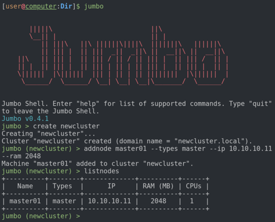

# Welcome!

This is the documentation of Jumbo - a tool allowing to deploy local virtualized Hadoop clusters in minutes. You will find a [getting started guide](/docs/getting-started) as well as a detailed description of every command of the [Jumbo CLI](/docs/commands) and a complete [listing of services supported](/docs/supported) by Jumbo.

The versions of Jumbo and of the other project that it relies on (Vagrant, Ansible, etc.) are available [here](/docs/versions).

